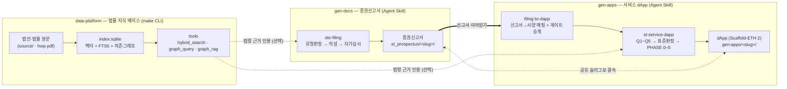
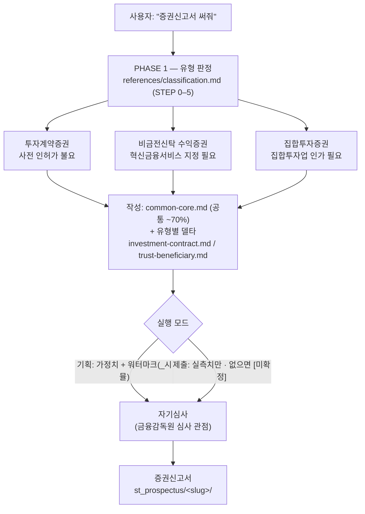
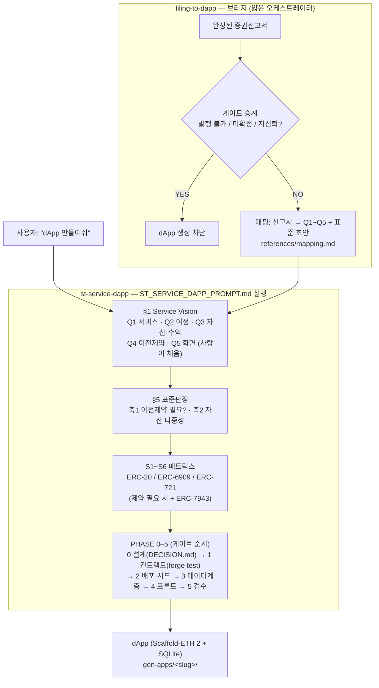
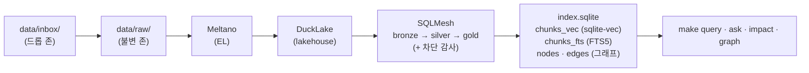
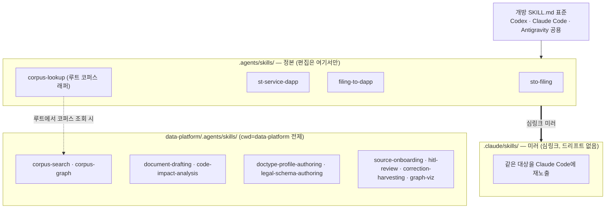

# 26bmdc 아키텍처

주요 서비스(법률 코퍼스 → 증권신고서 → dApp)와 그 사이를 잇는 스킬·프롬프트 구조를
다이어그램으로 정리한다. 각 영역의 세부 규칙은 그 영역의 문서가 지배하며(README·AGENTS·
각 SKILL.md), 이 문서는 **연결과 흐름**을 보여준다.

---

## 1. 전체 흐름 — 지식 → 문서 → 서비스

- 실선 굵은 화살표(`신고서 이어받기`)가 주요 서비스를 하나로 잇는 핵심 경로다.
- 점선(`법령 근거 인용`)은 **선택** 의존이다 — gen-docs·gen-apps는 코퍼스 없이도 완주한다.
- 신고서와 dApp은 **같은 슬러그**로 결속된다: `st_prospectus/<slug>/` ↔ `gen-apps/<slug>/`.

---

## 2. gen-docs — 증권신고서 (`sto-filing` 스킬)

- **판정이 먼저다:** 유형이 갈리면 문서 품질과 무관하게 발행 가능 여부 자체가 갈린다.
- 문서 골격의 ~70%는 `common-core.md` 하나로 관리하고, 유형별 파일은 **차이(델타)만** 담는다.
- 근거 조문은 코퍼스(`make -C data-platform query`)에서 인용하되, 없으면 `sources.md`로 대체.

---

## 3. gen-apps — 서비스 dApp (`st-service-dapp` + `filing-to-dapp`)

- `filing-to-dapp`는 **복제하지 않는다** — 문서는 `sto-filing`이, 생성은 `st-service-dapp`이
  그대로 하고, 이 스킬은 **매핑 + 게이트 승계**만 새로 담는다.
- **전매제한 → 표준 자동 확정:** 신고서 토큰은 규제상 전매제한이 있어 축1이 "제약 필요"로
  수렴 → ERC-7943(S2/S4/S6). 적격투자자·전매제한이 그대로 온체인 `TransferPolicy`가 된다.
- **발행 불가 증권은 dApp도 막는다:** sto-filing이 중단시킨 건 여기서도 중단한다.
- §2 설정(Token Standard=AUTO · MockUSDC · SQLite)은 고정이라 사람이 채우지 않는다.

---

## 4. data-platform — 코퍼스 색인 파이프라인

- 단일 SQLite 파일에 **벡터 · 키워드 · 그래프**가 함께 산다 — 세 소스가 서로 어긋나지 않는다.
- `hybrid_search`(벡터+FTS5 RRF 융합) · `graph_query`(의존 그래프) · `graph_rag`(검색 +
  그래프로 연결된 문서의 관련 조문). 읽기 경로에 네트워크 호출이 없다(오프라인).

---

## 5. 스킬 구조 — 정본과 미러

- `.agents/skills/`가 **정본**, `.claude/skills/`는 그 심링크 미러 — 두 벌이 드리프트하지 않는다.
- 루트 스킬은 루트 cwd 전제, data-platform 스킬은 **cwd=data-platform** 전제. 루트에서
  코퍼스가 필요하면 원본 대신 `corpus-lookup` 래퍼를 쓴다.

---

> 이 다이어그램들은 프로젝트 구조의 **하한**이다 — 코드·프롬프트가 선언한 연결만 담는다.
> 각 절차의 정본은 해당 SKILL.md와 `data-platform/README.md`다.
