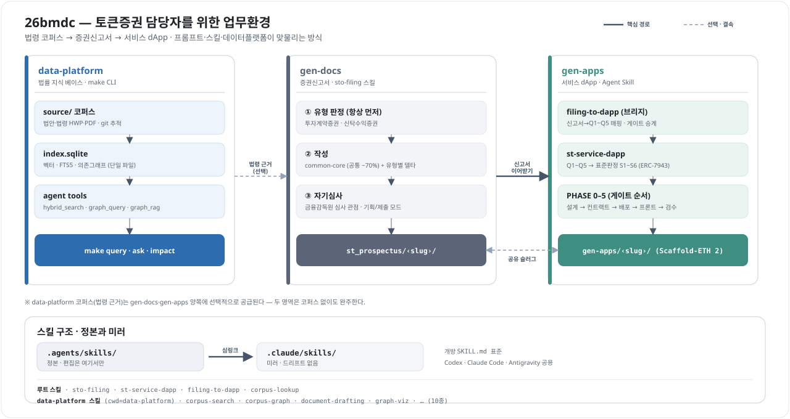
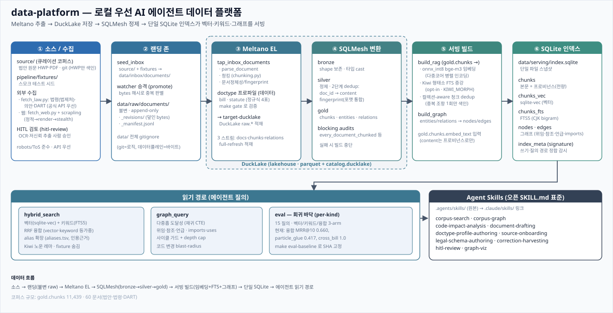
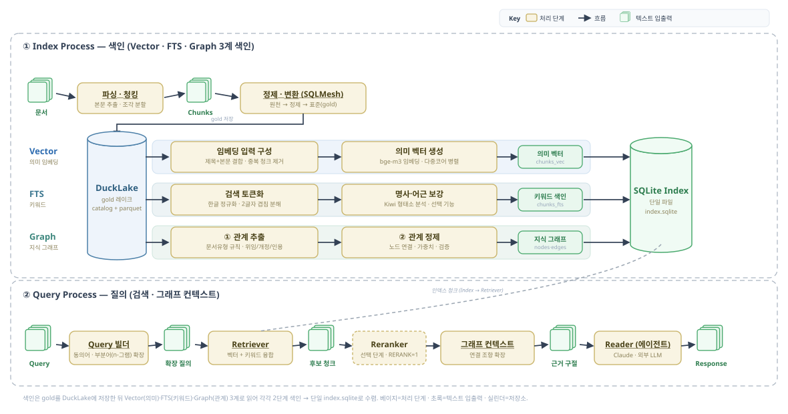

# 26bmdc — 한국 STO 규제 지식에서 온체인 서비스까지

한국은 2026년 토큰증권 제도를 시행하며 조각투자·STO 발행 경로가 열렸다. 이 저장소는
**그 규제를 다루는 개발자·기획자**가 하나의 흐름으로 일하도록 돕는다: 법령 근거를
조회하고 → 증권신고서 초안을 만들고 → 그 신고서를 프로토타입 dApp으로 잇는다.

> 약어: **STO**(Security Token Offering, 토큰증권 공모) · **RWA**(Real-World Asset,
> 실물연계자산) · **dApp**(탈중앙화 애플리케이션) · **DART**(금융감독원 전자공시시스템) ·
> **혁신금융서비스**(금융규제 샌드박스).
>
> 기술 용어: **코퍼스**(검색용으로 색인해 둔 문서 모음) · **색인/인덱스**(빨리 찾도록
> 미리 정리해 둔 데이터) · **하이브리드 검색**(뜻이 비슷한 문서를 찾는 *벡터* 검색과
> 정확한 단어를 찾는 *키워드* 검색을 합친 방식) · **의존 그래프**(법안이 어떤 법률에
> 위임·참조하는지 나타낸 문서 사이의 관계망) · **슬러그**(파일·폴더 이름에 쓰는 짧은 영문 식별자).



세 영역은 **독립적으로도** 쓰이고, 하나로 이으면 "규제 지식 → 공시 문서 →
배포 가능한 서비스"가 한 흐름이 된다.

**이 저장소는 AI 에이전트로 구동된다.** `data-platform`은 `make` CLI를 제공하지만,
`gen-docs`·`gen-apps`는 **Agent Skill**로 동작한다 — 사람이 직접 실행하는 CLI가 아니라,
에이전트(Claude Code·Codex·Antigravity)가 요청 내용에 맞게 자동으로 불러오는 절차
묶음이다. 즉 사용자는 에이전트에게 자연어로 요청하고, 에이전트가 스킬을 로드해 문서나
dApp을 만든다.

---

## 세 영역 지도

| 영역 | 무엇을 하나 | 산출물 | 구동 방식 |
|---|---|---|---|
| **`data-platform/`** | 한국 법안·법률 원문을 색인해 하이브리드 검색(벡터+키워드)과 의존 그래프로 조회 | `data/serving/index.sqlite` | `make` CLI |
| **`gen-docs/`** | 조각투자·STO 증권신고서를 유형 판정 → 작성 → 자기심사 | `gen-docs/st_prospectus/<slug>/` | Agent Skill (`sto-filing`) |
| **`gen-apps/`** | Security Token(RWA) 서비스 dApp을 생성. 신고서에서 이어받거나 직접 | `gen-apps/<slug>/` | Agent Skill (`st-service-dapp`, `filing-to-dapp`) |

`gen-docs`·`gen-apps`는 **코퍼스(색인된 문서 모음) 없이도 완주**된다. `data-platform` 코퍼스는 법령 조문을
직접 인용해 근거를 강화하는 **선택 요소**이자, 그 자체로 법안을 검색·추론하는 도구다.

```
26bmdc/
├── README.md · ARCHITECTURE.md · LICENSE   # 우산 문서 (MIT 라이선스)
├── AGENTS.md              # 영역 간 규약 정본 (에이전트 지침, 지도)
├── CLAUDE.md              # @AGENTS.md 포인터 (Claude Code 진입점)
├── docs/                  # 아키텍처 다이어그램 (overview.svg · architecture.svg · system.svg)
├── .agents/skills/        # 루트 스킬 정본 (sto-filing·st-service-dapp·filing-to-dapp·corpus-lookup)
├── .claude/skills/        # 위를 미러 (심링크)
├── data-platform/         # ── 코퍼스(문서 색인) 파이프라인
│   ├── README.md          #    셋업·아키텍처·근거 (이 영역의 정본)
│   ├── Makefile           #    make build / query / ask / impact / graph 등
│   ├── source/            #    실제 코퍼스 (법안 원문 hwp/pdf) — git 추적 대상
│   └── pipeline/ transform/ agent/ 등
├── gen-docs/
│   └── st_prospectus/
│       ├── sto-filing/    #    스킬 소스 = 정본 (SKILL.md + references/)
│       ├── prompt-templates/  # 프롬프트 골조 = 정본
│       ├── build_prompts.py   # 생성기 (PACKAGING.md 참조)
│       ├── dist/          #    생성물: 단독 실행 프롬프트 3종
│       └── <slug>/        #    생성된 증권신고서가 쌓이는 곳
└── gen-apps/
    ├── ST_SERVICE_DAPP_PROMPT.md  # dApp 생성 대형 프롬프트 (Q1~Q5만 사람이 채움)
    ├── st-service-dapp/   #    스킬 소스
    ├── filing-to-dapp/    #    신고서→dApp 브리지 스킬 소스
    └── <slug>/            #    생성된 dApp이 쌓이는 곳
```

**data-platform 파이프라인 상세** — 코퍼스가 색인되는 전체 경로(수집 → 랜딩 → Meltano
EL(수집·적재) → SQLMesh(변환) → 서빙 빌드):



**색인·질의 런타임** — 위 파이프라인이 만든 gold를 DuckLake에 저장한 뒤, Vector(의미)·
FTS(키워드)·Graph(관계) **3계로 나눠 `index.sqlite`를 색인**한다. 질의는 하이브리드 검색
(벡터+키워드) + 그래프 컨텍스트로 답하며, 각 단계의 대표 실패 지점도 함께 표시했다:



> 각 영역 내부 흐름을 담은 mermaid 다이어그램 5종은 [`ARCHITECTURE.md`](ARCHITECTURE.md) 참조.

---

## 빠른 시작

### 전제

- **AI 에이전트** — Claude Code, Codex, 또는 Antigravity. `gen-docs`·`gen-apps`는
  에이전트가 스킬을 로드해 구동한다.
- **Python 3.12 권장(≥3.10) + [uv](https://docs.astral.sh/uv/)** — data-platform
  파이프라인용. 버전 플로어의 정본은 `data-platform/README.md`의 *Version floors*.
- **Node.js 22.10+** — gen-apps 산출물(Scaffold-ETH 2 dApp)을 실제로 띄울 때만.
  저장소에 `.nvmrc`가 있어 `nvm use`면 맞는 버전으로 붙는다. **최신 Node를 쓰면 오히려
  막힐 수 있다** — 네이티브 모듈(`better-sqlite3`)에 그 버전용 prebuilt가 아직 없으면
  소스 빌드로 떨어져 실패한다.
- **[Foundry](https://getfoundry.sh)** (`forge`·`anvil`·`cast`) — gen-apps에서만.
  **`forge`가 PATH에 없으면 스캐폴딩 자체가 중단된다**(`create-eth`가 검증한다).
  설치돼 있어도 PATH에 없으면 같으니 `forge --version`으로 먼저 확인한다
  (`~/.foundry/bin`이 흔한 위치).

### 0. 에이전트 열기 (스킬을 쓰는 법)

저장소 루트(또는 작업할 하위 폴더)에서 에이전트를 연다 — Claude Code는 터미널에서
`claude`, Codex·Antigravity는 이 폴더를 작업 폴더로 연다. 그 세션 안에서 **자연어로
요청**하면 에이전트가 요청에 맞는 스킬을 자동 로드한다. 아래 예시의 따옴표 문장이
그대로 입력이다.

### 1. 증권신고서 만들기 (gen-docs) — 코퍼스 없이도 동작

에이전트에게:

> "이 조각투자 상품으로 증권신고서 써줘" · "이게 투자계약증권에 해당하나요?"

`sto-filing` 스킬이 **증권 유형(투자계약증권 / 비금전신탁 수익증권 / 집합투자증권)을
먼저 판정**한 뒤 유형별 기준으로 작성하고, 금융감독원 심사 관점으로 자기심사한다.
유형이 갈리면 발행 가능 여부 자체가 갈리므로 판정을 건너뛰지 않는다. 산출물은
`gen-docs/st_prospectus/<slug>/`에 쌓인다.

### 2. 서비스 dApp 만들기 (gen-apps)

- **신고서에서 이어서** — `filing-to-dapp`: 완성된 신고서를 dApp 사양으로 역매핑하고
  게이트를 승계한 뒤 생성으로 이어붙인다.
  > "신고서 다 썼으니 이어서 앱 만들어줘"
- **직접** — `st-service-dapp`: 서비스 비전(Q1~Q5)을 확정한 뒤
  `ST_SERVICE_DAPP_PROMPT.md`를 실행해 Scaffold-ETH 2 기반 dApp을 끝까지 생성한다.
  > "부동산 조각투자 dApp 만들어줘"

산출물은 `gen-apps/<slug>/`에 쌓인다(신고서와 같은 슬러그로 결속된다).

### 3. (선택) 법률 코퍼스 색인·조회 (data-platform)

코퍼스는 그 자체로 법령 검색 도구이자, 위 문서·dApp 생성의 근거를 강화하는 선택
요소다. 색인을 빌드하면 조문을 직접 인용할 수 있다:

```bash
cd data-platform
make setup      # uv sync + meltano install (최초 1회, 의존성 변경 시 재실행)
make build      # inbox → DuckLake → SQLMesh → index.sqlite, 그리고 smoke 테스트
```

`make build`는 멱등이다 — 몇 번을 돌려도 행을 중복하지 않고 raw 존을 건드리지 않는다.
빌드 후:

```bash
make query Q="예치금 분리보관 의무"          # 하이브리드 검색 (벡터+키워드)
make ask   Q="스테이블코인 발행자 준비자산"    # 위 + 그래프로 연결된 문서의 관련 조문까지
make impact NODE=<node>                      # 의존 그래프 상 영향 범위
```

루트에서 코퍼스만 빠르게 조회하려면 `make -C data-platform query Q="<질의>"`. 셋업·
아키텍처·검색 원리의 정본은 **`data-platform/README.md`**다.

---

## 대표 워크플로 · 스킬

| 하고 싶은 것 | 영역 | 실행 |
|---|---|---|
| 법안이 무엇을 규정하는지 근거로 답 | data-platform | `make query`/`make ask`, 또는 `corpus-search`·`corpus-graph` 스킬 |
| 코퍼스에 근거한 문서 초안·요약 | data-platform | `document-drafting` 스킬 (cwd=data-platform) |
| 조각투자 상품의 증권신고서 | gen-docs | `sto-filing` 스킬 |
| 신고서를 온체인 서비스로 | gen-apps | `filing-to-dapp` 스킬 (sto-filing + st-service-dapp 오케스트레이션) |
| RWA/증권형 dApp 직접 | gen-apps | `st-service-dapp` 스킬 |

**엔드투엔드 예시:** 코퍼스로 규제 경로 확인(`make ask`) → 증권신고서 작성
(`sto-filing`) → 같은 슬러그로 dApp 생성(`filing-to-dapp`). 세 영역이 하나의 사업을
지식·문서·서비스 세 계층에서 표현한다.

**루트 스킬** (`.agents/skills/`): `sto-filing`, `st-service-dapp`, `filing-to-dapp`,
그리고 루트에서 코퍼스를 조회하는 얇은 래퍼 `corpus-lookup`.
**data-platform 스킬** (`data-platform/.agents/skills/`, **cwd=data-platform 전제**):
`corpus-search`, `corpus-graph`, `code-impact-analysis`, `document-drafting`,
`doctype-profile-authoring`, `source-onboarding`, `hitl-review`,
`correction-harvesting`, `graph-viz`, `legal-schema-authoring`. 루트에서 코퍼스가
필요하면 원본 대신 `corpus-lookup` 래퍼를 쓴다.

---

## 영역 간 규약

세 영역을 하나로 묶는 것은 세 개의 얇은 규약뿐이다. 정본은 루트 `AGENTS.md`이며, 여기서는
요약만 둔다.

- **공유 슬러그** — 하나의 사업은 증권신고서와 dApp에서 **같은 kebab-case ASCII
  슬러그**로 묶인다: `gen-docs/st_prospectus/<slug>/`(문서) ↔ `gen-apps/<slug>/`(dApp).
  발행사+증권명에서 파생한다. **예약어**(슬러그로 금지): `sto-filing`,
  `st-service-dapp`, `filing-to-dapp`. 이 슬러그는 data-platform의 node-id
  슬러그(한글·언더스코어 유지)와 **별개** 체계다.
- **루트에서 코퍼스 조회** — `make -C data-platform query Q="<질의>"`. 색인이 먼저
  빌드돼 있어야 한다. 검색 규칙·랭킹 해석의 정본은 `data-platform/AGENTS.md`와
  `corpus-search` 스킬이다.
- **gen-docs→gen-apps 브리지** — `filing-to-dapp`가 담당한다: 완성된 신고서에서
  서비스 사실(기초자산·수익구조·전매제한·적격투자자 요건)을 뽑아 dApp의 Q1~Q5와 토큰
  표준으로 역매핑하고, 신고서의 **발행 불가 판정을 dApp 게이트로 승계**해 발행 불가한
  증권은 dApp 생성도 막는다.

---

## 기여·유지보수 규약

- **AGENTS.md가 에이전트 지침의 정본이다.** 루트 `AGENTS.md`는 지도와 영역 간 규약만
  담고, 각 영역의 세부는 그 영역 문서가 지배한다. `CLAUDE.md`는 `@AGENTS.md` 한 줄
  포인터다(Claude Code만 `CLAUDE.md`를 읽으므로). 규약은 `AGENTS.md`에서만 고친다.
- **스킬은 `.agents/skills/`에서만 편집**하고 `.claude/skills/`는 미러다.
  Windows에서 심링크가 깨지면 `data-platform`의 `make sync-skills`로 복사한다.
- **clone 후 한 번 `make hooks`.** 커밋할 때 `make check`가 자동으로 돌게 한다
  (`core.hooksPath`는 git이 clone에 딸려 보내지 않아 각자 한 번은 실행해야 한다).
  급하면 `git commit --no-verify`로 건너뛴다.
- **커밋 전에 `make check`.** 저장소 루트에서 몇 초면 끝난다 — `ruff` 린트, 스킬
  프론트매터를 **YAML 파서로** 확인(`name`↔디렉터리 일치 포함), `dist/`가 스킬 정본과
  어긋나지 않았는지 확인. 자동수정은 `make fmt`(import 정렬·표기 현대화만 건드린다).
  data-platform까지 포함한 전체 게이트는 `make verify`(빌드가 돌아 느리다).
  린트 규칙은 `ruff.toml`에 얇게 두었다 — 줄 길이는 강제하지 않고, 의도적인 광범위
  `except`도 규칙으로 막지 않는다.
- **sto-filing 패키징** — `sto-filing/` 또는 `prompt-templates/`를 고쳤으면
  `make prompts`(= `python3 build_prompts.py`)로 `dist/` 프롬프트 3종을 재생성한다.
  잊으면 배포본이 옛 버전을 조용히 서빙하는데, 이제 `make check`가 그걸 잡는다.
  `dist/`는 손으로 고치지 않는다. `gen-docs/st_prospectus/PACKAGING.md` 참조.
- **data plane은 절대 커밋하지 않는다** — `data-platform/data/`는 전부 git-ignore
  대상이다. 코퍼스 원본은 `data-platform/source/`에 두며(이곳은 git-ignore 대상이
  아니라 추적 대상이다), 근거는 `data-platform/README.md`의 control/data plane 절.

> **저장소 경계·상태:** 루트 `26bmdc/` 전체가 **하나의 git 저장소**로
> `data-platform`·`gen-docs`·`gen-apps`를 함께 추적한다(원격
> `github.com/fistline/2026BCMD`, branch `main`). `data-platform/source/`의 코퍼스
> 원본(법안 hwp/pdf)은 추적·커밋되어 clone에 함께 실린다. `data/`·`.venv`·`.meltano`는
> 재생성물이라 gitignore 대상이다.

---

## 트러블슈팅 · 더 읽기

- 빌드/검증 실패, Windows 심링크, 버전 플로어 → `data-platform/README.md`의
  *Verification*·*Version floors* 절과 `data-platform/AGENTS.md`.
- 각 영역 절차의 정본: `gen-docs/st_prospectus/sto-filing/SKILL.md`,
  `gen-apps/st-service-dapp/SKILL.md`, `gen-apps/filing-to-dapp/SKILL.md`.
- 전체 구조를 그림으로: **`ARCHITECTURE.md`** (세 영역·스킬·파이프라인 다이어그램).

## 라이선스·유의

이 프로젝트는 **MIT 라이선스**다 — `LICENSE` 참조. `data-platform/source/`의 법안
원문은 공개된 국회 의안 자료다. 생성되는 증권신고서·dApp은 **참고용 초안**이며
법률자문·투자권유가 아니다 — 실제 제출·발행 전 법률의견서 확보와 금융감독원
사전협의를 권고한다.
